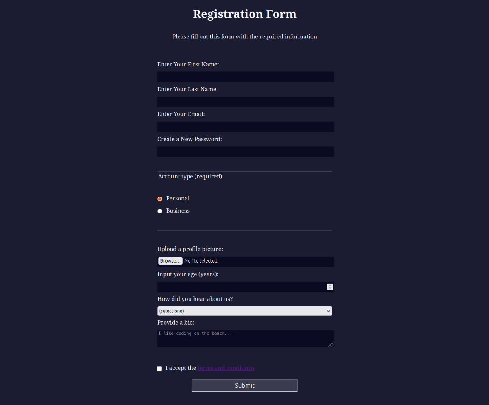

## 📋 Registration Form Project

A clean and responsive **Registration Form** built with **HTML and CSS**.  
This project demonstrates how to create an accessible and well-structured form with proper validation and user-friendly design.



---

### 🔧 Features

✅ Responsive layout that works on all screen sizes  
✅ Form validation for required fields  
✅ Password pattern requirements  
✅ Age input with min/max restrictions  
✅ Clean and professional UI  
✅ Proper semantic HTML structure  
✅ Accessible form controls with labels  

---

### 🛠️ Built With

- HTML5 (Semantic elements, Form validation)  
- CSS3 (Responsive design, Flexbox)  

---

### 📂 Folder Structure

```
registration-form/
│
├── index.html
└── styles.css
```

---

### ▶️ How to Run

1. Clone this repository:
```bash
git clone https://github.com/your-username/your-repo.git
```

2. Navigate to the project folder:
```bash
cd registration-form
```

3. Open `index.html` with your browser.

---

### 🧠 Project Purpose

This project was created as a practice exercise for:
- Building accessible web forms  
- Implementing client-side validation  
- Creating responsive layouts  
- Practicing semantic HTML structure  

---

### 📌 TODO

- [ ] Add JavaScript for enhanced validation  
- [ ] Improve styling for file inputs  
- [ ] Add success message after submission  
- [ ] Make radio buttons more visually appealing  

---

### 🌟 Contribution

If you find this useful or want to improve it, feel free to fork the repo and submit a PR!

---

Made with ❤️ by [Erfan Alishahi](https://github.com/Erfan-Alishahi)
